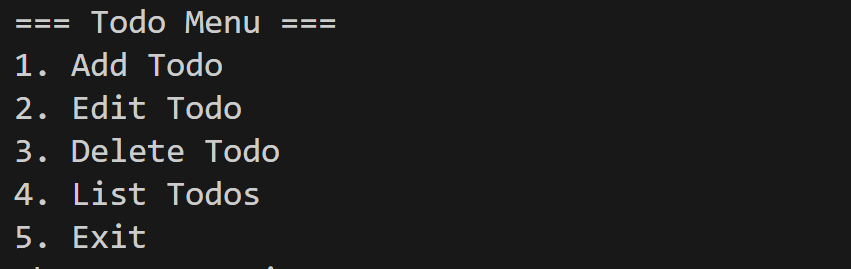
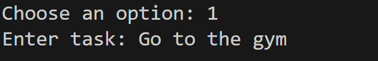
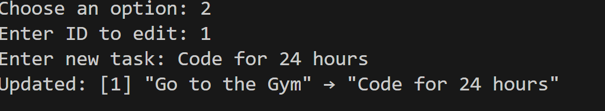
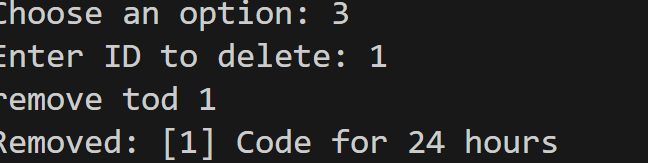
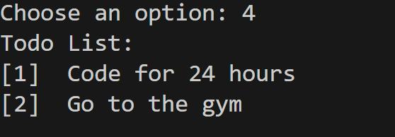

# Simple Todo List App (TypeScript)

This is a simple command-line Todo List application built using **TypeScript** and **Node.js**. It allows users to:

- Add a task
- Edit a task
- Delete a task
- View all tasks
- Interact with a simple terminal menu

---

## 📁 Project Structure

```bash
├── Task2
  ├── todo.ts # Source code (TypeScript)
  ├── todo.js # Compiled JavaScript
  ├── package.json
  ├── tsconfig.json
  ├── Screenshots
  └── README.md
```

---

## 🚀 How to Run the Project

### 1. Clone the Repository

```bash
git clone https://github.com/milkiyas-web/A2SV-Web-track/new/main/Task2
cd Task2
```

### 2. Install the dependancies

```bash
npm install
```

### 3. Compile the typescript

```bash
npx tsc
```

### 4. Run the node file

```bash
node todo.js
```

### You’ll see a menu like this



🧪 Example Usage
Choose 1 to add a task

Choose 2 and enter an ID to edit a task

Choose 3 and enter an ID to delete

Choose 4 to see your list

Choose 5 to exit.

🛠️ Built With
TypeScript
Node.js (readline module)
