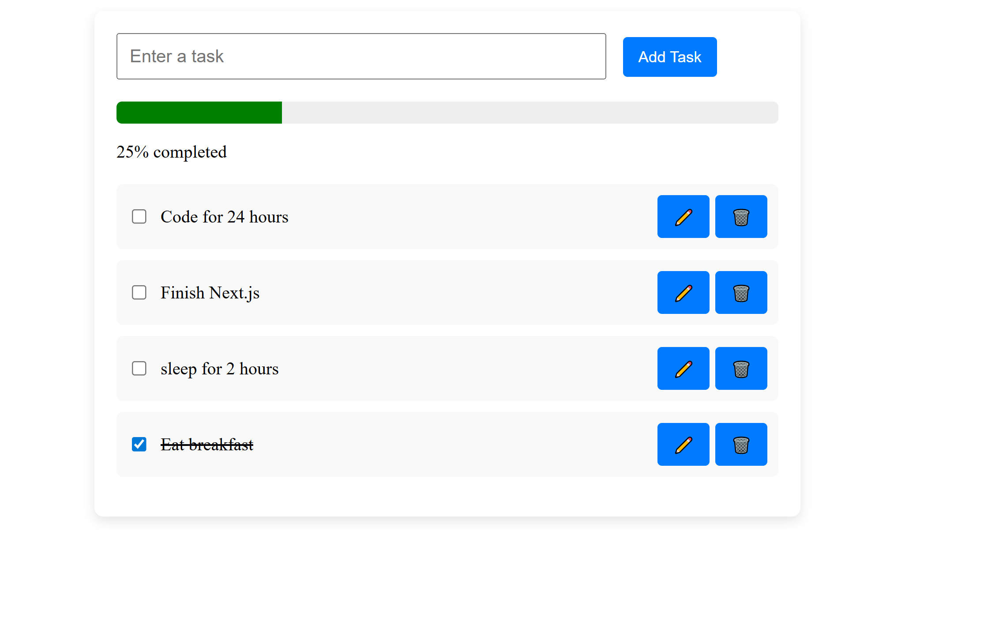
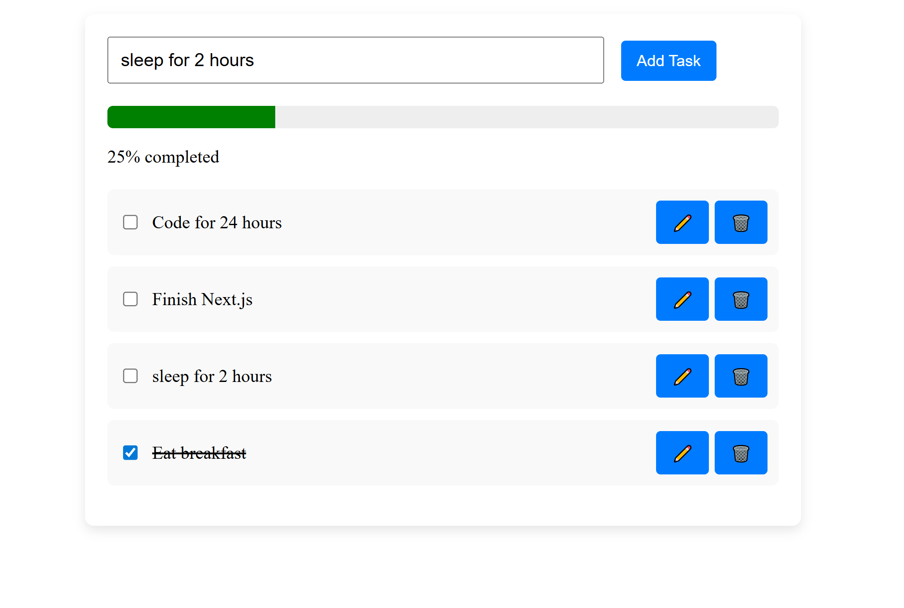
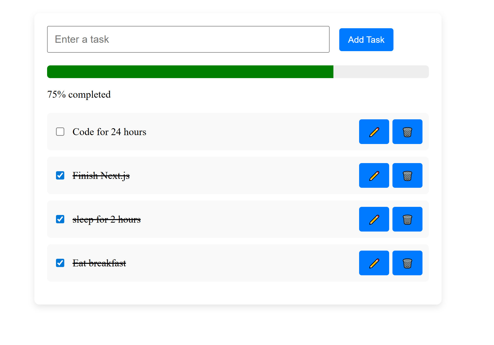

# 📝 Todo App

This is a simple and minimalistic **Todo List Web Application** built with React and Typescript. It allows users to:

- Add new tasks
- Edit existing tasks
- Delete tasks

The interface is clean, responsive, and centered on the screen.

---

## How to Run the Project

1. Clone or download this repository to your local machine.
2. open the file

```bash
git clone https://github.com/milkiyas-web/A2SV-Web-track.git
cd Todoapp-react
npm install
npm run dev
```

## 📸 Screenshots

---

### Main Page


\_Description: This shows the centered todo app with the input and list interface with a progress bar. a user can write on the input and click on the Add button which then adds the task to the list so it can be displayed.

### Editing a Task


\_Description: By clicking the edit button a user will the task to be edited iside the input box. after making the edits the user can again press the add task button to add/save it back with the changes made.



Thank You !!!
