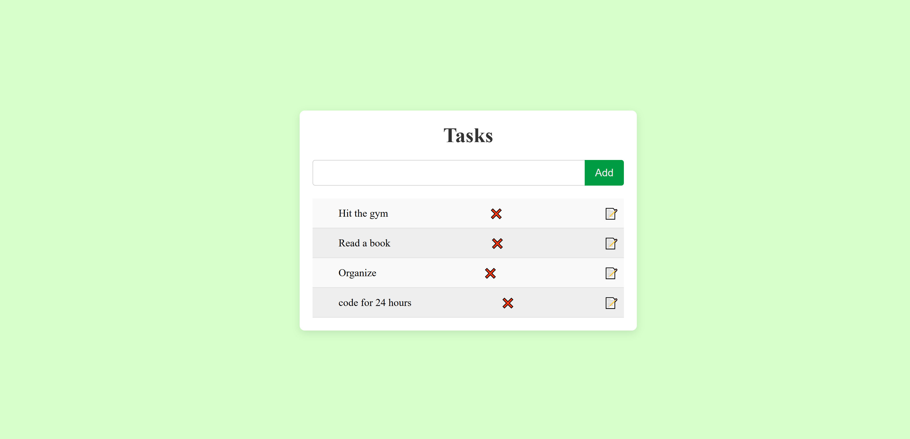

# 📝 Todo App

This is a simple and minimalistic **Todo List Web Application** built with HTML, CSS, and JavaScript. It allows users to:

- Add new tasks
- Edit existing tasks
- Delete tasks

The interface is clean, responsive, and centered on the screen.

-------------------------------------------------------------------------------------------------------------------------------------------------------------------

## How to Run the Project

1. Clone or download this repository to your local machine.
2. Open the `index.html` file in any modern web browser.


```bash
git clone https://github.com/milkiyas-web/A2SV-Web-track.git
cd Todoapp
open index.html
```

## 📸 Screenshots
----------------------------------------------------------------------------------------------------------------------------------------------------------


### Main Page

*Description: This shows the centered todo app with the input and list interface. a user can write on the input and click on the Add button which then triggers the onClick() function iside javascript to add the task to the list so it can be displayed.*

### Editing a Task

*Description: By clicking the edit button a user can edit the task he/she just added and then press the save button to save the task with the necessary changes.*
