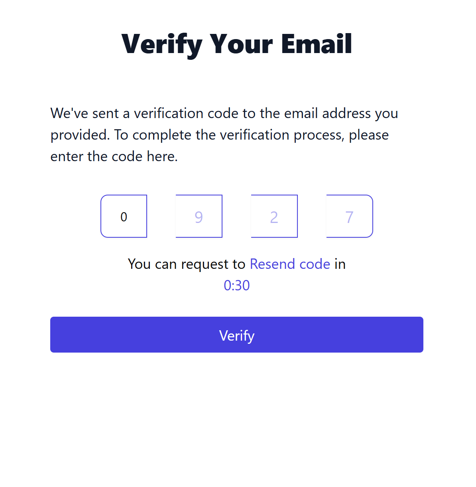

# Auth System – Sign Up, Sign In, and Email Verification

This project is a simple and responsive authentication flow built with **Next.js**, **React**, **TypeScript**, and **Tailwind CSS**, using **ShadCN UI** for elegant components and form validation powered by **Zod** and **React Hook Form**.

## ✨ Features

- ✅ User registration (email + password)
- ✅ Google sign-in via OAuth
- ✅ Email verification using OTP (4-digit code)
- ✅ Form validation with custom error messages
- ✅ Toast notifications for feedback
- ✅ Responsive design with Tailwind CSS
- ✅ Clean UI using ShadCN components

---

---

## 🔧 Technologies Used

- **Framework:** Next.js 14 / App Router
- **Styling:** Tailwind CSS + ShadCN UI
- **Forms:** React Hook Form
- **Validation:** Zod
- **Auth:** Google OAuth + Email/Password
- **Notifications:** ShadCN `use-toast`

---

## 🧪 API Integration

### 1. Sign Up

**POST** `https://akil-backend.onrender.com/signup`

```json
{
  "name": "John Doe",
  "email": "john@example.com",
  "password": "securepass"
}
```

→ Automatically sends a 4-digit OTP to email.


**POST** POST `/verify-email`

```json
{
  "email": "john@example.com",
  "OTP": "1234"
}
```

**POST** `/login`

```json
{
  "email": "john@example.com",
  "password": "securepass"
}
```

## 🧪 Getting Started

### 1. Clone the repo

```bash
git clone https://github.com/milkiyas-web/A2SV-Web-track.git/auth-task8
cd auth-task8
```

### 2. Install the dependancies

```bash

npm install

```

### 3. Run the dev environment

```bash

npm run dev

```

## 📸 Screenshots

---

### Main Page


\_Description: client-side validation for input fields By utilizing zod


\_Description: Signin Page

Thank You!!!
