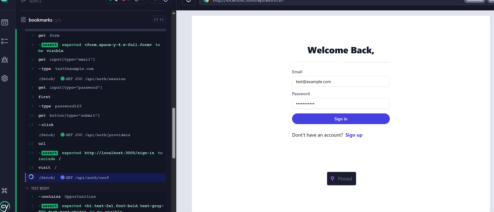

# 🧰 Job Listing App

A modern job board built with **Next.js App Router**, **TypeScript**, **Tailwind CSS**, and **NextAuth** for authentication. Users can browse jobs, bookmark positions they’re interested in, and manage their saved jobs securely.

---

## 🚀 Features

- 🔍 Browse job listings with details
- 📌 Bookmark/Unbookmark jobs (for authenticated users)
- 🧾 View all saved/bookmarked jobs
- 🔐 Auth integration via NextAuth
- ✅ Fully tested (Jest + Cypress)

---

## 🧑‍💻 Tech Stack

- **Frontend:** Next.js (App Router), React, TypeScript
- **Styling:** Tailwind CSS
- **Authentication:** NextAuth
- **API:** External API
- **Testing:**
  - 🧪 Unit Tests: Jest + React Testing Library
  - 🧩 Component Tests
  - 🧭 E2E Tests: Cypress

---

---

## 🔧 Getting Started

### 1. Clone the Repo

```bash
git clone https://github.com/milkiyas-web/A2SV-Web-track/final-task
cd final-task

npm install

```

### 2. Set Environment Variables

### Create a .env.local file:

```bash
NEXTAUTH_URL=http://localhost:3000
NEXTAUTH_SECRET=your-secret
NEXT_PUBLIC_BASE_URL=
GOOGLE_CLIENT_ID=
GOOGKE_SECRET_KEY=

```

### 3. run dev

```bash
npm run dev

```

## 📸 Screenshots

---

### Main Page


\_Description: This page shows the jobs that are bookmarked by an authenticated user.

## Bookmarks


\_Description: This page shows testing bookmarking functionality of different jobs posted on the website

### LogIn test



Description: This shows the test when user signs in with a toast message to let the user know that signin is successful.

Thank You!!!
