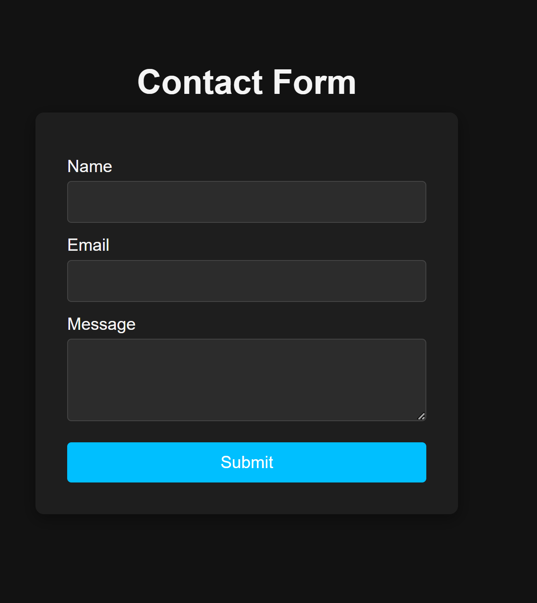
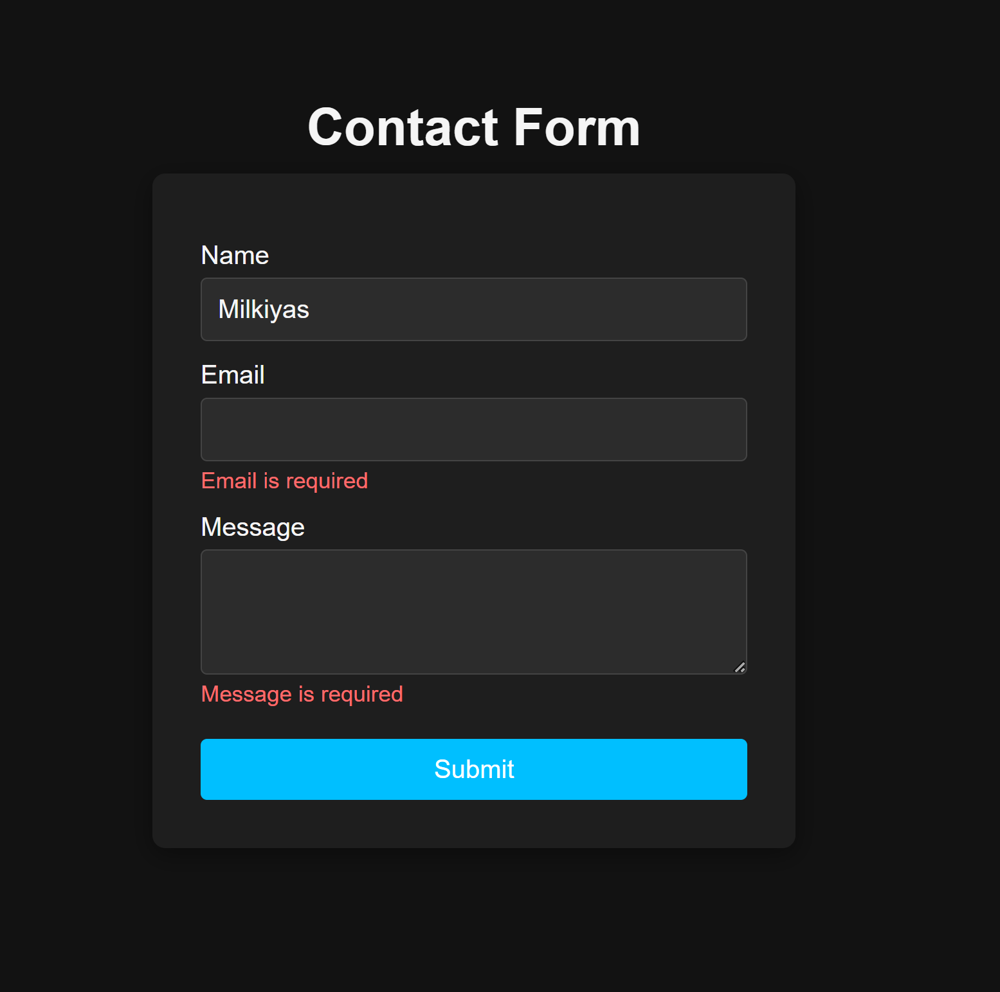
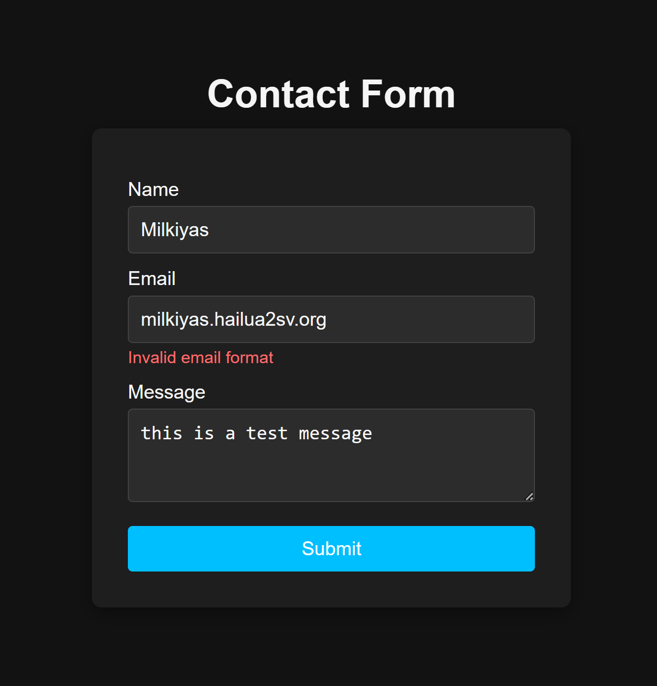

# 📝 Contact Form

This is a simple and minimalistic **Contact Form** built with React, TypeScript, and **react-hook-form**. It allows users to:

- ✅ Enter their **Name**, **Email**, and **Message**
- ✅ Validates required fields and email format
- ✅ Displays error messages for invalid inputs
- ✅ Uses a responsive dark theme for modern UI

The interface is clean, centered on the screen, and easy to use.

---

## 🚀 How to Run the Project

1. Clone or download this repository to your local machine.
2. Navigate to the project folder and install dependencies:

```bash
git clone https://github.com/milkiyas-web/A2SV-Web-track.git/task5-react-form
cd task5-react-form
npm install
npm run dev
```

## 📸 Screenshots

---

### Main Page


\_Description: This shows the contact form with dark theme and centered layout. It includes input fields for name, email, and message, with a submit button.

### Form Validation



Description: Shows error messages when the form is submitted with missing or invalid inputs.


Description: Shows error messages when the form is submitted with invalid email inputs.
Thank You !!!
