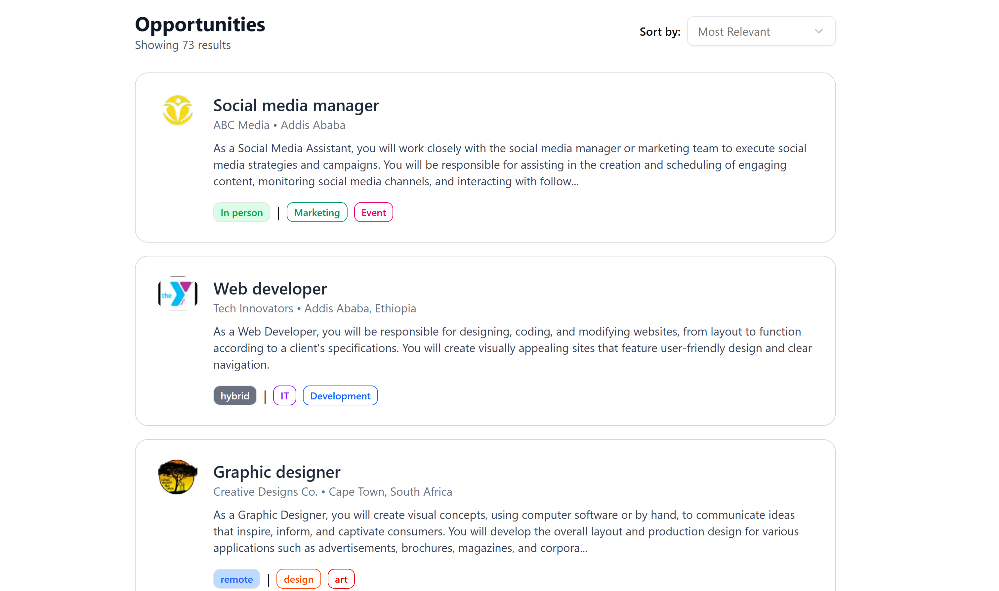
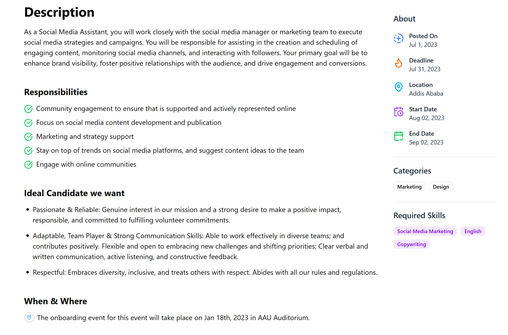

# 💼 Job Listing Application

A job board built with **Next.js**, **TypeScript**, and **Tailwind CSS**. It allows users to browse, filter, and view detailed information about various job opportunities

## 🚀 Features

- 🔍 Browse job listings with position and location info
- 📄 Detailed job pages with:
  - Full description
  - Responsibilities
  - Ideal candidate traits
  - Dates, deadlines, and location (When & Where)
  - Categories and required skills
- 🧠 Built with TypeScript for type safety

---

## 🛠️ Tech Stack

- **Frontend**: [Next.js](https://nextjs.org/), [React](https://react.dev/)
- **Styling**: [Tailwind CSS](https://tailwindcss.com/)
- **Components**: ShadCN UI (`badge`, `select`, etc.)
- **Types**: TypeScript
- **Data**: Static JSON (`/data/jobs.json`)

---

## 🧪 Getting Started

### 1. Clone the repo

```bash
git clone https://github.com/milkiyas-web/A2SV-Web-track.git/task6
cd task6
```

### 2. Install the dependancies

```bash

npm install

```

### 3. Run the dev environment

```bash

npm run dev

```

## 📸 Screenshots

---

### Main Page


\_Description: This page shows the different jobs posted on the website

### Each job description



Description: On this page each job has it's own description and requirement. from the data.json provided

Thank You!!!
